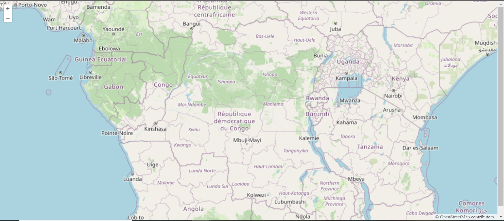

# Creating a Simple Web Map

### Things you need:
1. Visual Studio Code
2. Node.Js Installed

### Installations
1. Install Vite: npm create vite@latest

2. Install Openlayers: npx create-ol-app my-app --template

3. Running the code:
a. Browse into working directory: cd my-app
b. running: npm start

## Results:
A url that when pasted into a browser we get the images below as our final result: A Simple Web Map

